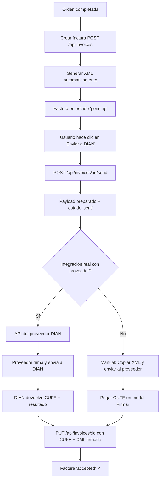

# Módulo DIAN — Estado de Integración

> **Última actualización:** 2026-07-15  
> **Versión:** 4.1 (Resolución DIAN 000008 de 2023)

---

## Estado General

| Componente | Estado | Archivo |
|------------|--------|---------|
| Tabla `invoices` (DB) | ✅ Completa | `server/db.js` |
| Tabla `credit_notes` (DB) | ✅ Completa | `server/db.js` |
| Schema Zod | ✅ Completo | `server/schemas/invoices.js` |
| CRUD Backend | ✅ Completo | `server/routes/invoices.js` |
| Generación XML | ✅ Completa | `server/services/dianXml.js` |
| Estructura Firma Digital | ✅ Guía estructural | `server/services/dianSigner.js` |
| Frontend CRM | ✅ Completo | `src/views/roles/InvoicesView.tsx` |
| API Service | ✅ Completo | `src/services/api.ts` |
| WebSocket | ✅ `invoice:update` | `server/routes/invoices.js` |
| **Firma digital real** | ❌ [Manual] | Ver abajo |
| **Conexión proveedor DIAN** | ❌ [Manual] | Ver abajo |
| **Certificado digital** | ❌ [Manual] | Ver abajo |
| **CUFE real** | ❌ [Manual] | Ver abajo |

---

## ✅ Lo que ya funciona

### Creación de facturas
- `POST /api/invoices` — Crea factura, genera XML automáticamente, asigna número secuencial
- Almacena datos del emisor y receptor como JSON en la DB
- El XML generado sigue el estándar UBL 2.1 de DIAN versión 4.1

### Envío a DIAN (simulado)
- `POST /api/invoices/:id/send` — Prepara payload completo para el proveedor
- Actualiza estado a `sent`
- Devuelve instrucciones para el siguiente paso
- Incluye WebSocket `invoice:update`

### Reenvío
- `POST /api/invoices/:id/resend` — Regenera XML y payload, reenvía

### Actualización de firma
- `PUT /api/invoices/:id` — Actualiza CUFE, XML firmado, estado, respuesta DIAN

### Frontend
- Visor de XML expandible por factura
- Botón "Enviar a DIAN" para facturas pendientes
- Botón "Reenviar" para facturas enviadas
- Modal de "Firma Manual" para ingresar CUFE y XML firmado
- Botón de descarga de XML
- Impresión de factura (PDF)
- WebSocket en tiempo real

---

## ❌ Pasos Manuales Pendientes

### 1. Configurar datos reales del emisor

**Archivo:** `server/services/dianXml.js`

Editar el objeto `DIAN_CONFIG.emisor` con los datos reales del negocio:

```javascript
emisor: {
  nit: '900000000',           // [MANUAL] NIT sin digito de verificacion
  digitoVerificacion: '0',    // [MANUAL] Digito de verificacion
  razonSocial: 'JUANCHO PIZZA SAS',  // [MANUAL] Razon social real
  nombreComercial: "Juancho's Pizza", // [MANUAL] Nombre comercial
  direccion: 'Cra 7 #12-34', // [MANUAL] Direccion del establecimiento
  telefono: '3117074843',     // [MANUAL] Telefono de contacto
  email: 'contacto@juanchospizza.com', // [MANUAL] Email
  regimenFiscal: 'R-99-PJ',   // [MANUAL] Regimen fiscal
  responsabilidadFiscal: 'O-15', // [MANUAL] Responsabilidad fiscal
  codigoCiudad: '25489',      // [MANUAL] Codigo Dane de la ciudad
  codigoDepartamento: '25',   // [MANUAL] Codigo Dane del depto
}
```

### 2. Configurar resolución DIAN

En `DIAN_CONFIG.facturacion.rangoNumeracion`:

```javascript
rangoNumeracion: {
  prefijo: 'FE',              // [MANUAL] Prefijo autorizado
  desde: 1,                   // [MANUAL] Desde numero
  hasta: 100000,              // [MANUAL] Hasta numero
  fechaAutorizacion: '2025-01-01',  // [MANUAL] Fecha resolucion
  numeroResolucion: '1876000000001', // [MANUAL] Numero resolucion DIAN
  claveTecnica: 'FCB48B9A-...',     // [MANUAL] Clave tecnica
}
```

### 3. Configurar software PSE (Proveedor)

En `DIAN_CONFIG.software`:

```javascript
software: {
  softwareId: 'a1b2c3d4-...',  // [MANUAL] ID del software en DIAN
  softwarePin: '0000...',       // [MANUAL] PIN del software
  proveedorTecnologico: 'MUISCA', // [MANUAL] 'MUISCA' | 'DATAICO' | 'NOVASOFT'
}
```

### 4. Obtener certificado digital

**Archivo:** `server/services/dianSigner.js`

Se requiere un certificado digital emitido por una entidad de certificación autorizada:

| Entidad | Tipo | Vigencia |
|---------|------|----------|
| Andrés Díaz - SF | Firma electrónica | 1-3 años |
| Certicámara | Firma electrónica | 1-3 años |
| GSE | Firma electrónica | 1-3 años |

Pasos:
1. Adquirir certificado digital (.pfx o .p12)
2. Configurar `CERTIFICADO_CONFIG` en `dianSigner.js`
3. Implementar la función `signXml()` usando `node-forge` o `xml-crypto`
4. Implementar `calcularCUFE()` con SHA-384

### 5. Elegir e integrar proveedor tecnológico

| Proveedor | Sitio | API |
|-----------|-------|-----|
| **Muisca** (DIAN oficial) | ccdn.dian.gov.co | SOAP/XML |
| **Dataico** | dataico.com | REST/SOAP |
| **Novasoft** | novasoft.com.co | REST |
| **Siesa** | siesa.com | API propia |
| **Alégrate** | alegrate.co | REST |

Flujo típico de integración:
1. Registrar el software en la DIAN (obtener SoftwareID y PIN)
2. Configurar los endpoints del proveedor en `server/services/dian.js` (por crear)
3. Enviar XML firmado al proveedor
4. Recibir respuesta con CUFE y resultado
5. Actualizar factura con `PUT /api/invoices/:id`

---

## 📋 Estructura de la Base de Datos

### Tabla `invoices`

```sql
id              TEXT PRIMARY KEY,
orderId         TEXT REFERENCES orders(id),
invoiceNumber   TEXT,
tipoDocumento   TEXT DEFAULT 'factura',     -- factura | pos | pos_electronica | documento_soporte
cufe            TEXT,                        -- CUFE de DIAN (SHA-384)
xml             TEXT,                        -- XML completo de la factura
pdf_url         TEXT,                        -- URL del PDF generado
status          TEXT DEFAULT 'pending',      -- pending | sent | accepted | rejected
dianResponse    JSON,                        -- Respuesta completa del proveedor DIAN
emisorInfo      JSON DEFAULT '{}',           -- Datos del emisor (NIT, razon social, etc.)
receptorInfo    JSON DEFAULT '{}',           -- Datos del cliente (receptor)
notes           TEXT,                        -- Notas de la factura
fechaVencimiento TIMESTAMPTZ,               -- Fecha de vencimiento
tipoOperacion   TEXT DEFAULT '10',           -- 10=venta | 20=compra | 30=exportacion | 40=otro
moneda          TEXT DEFAULT 'COP',          -- Moneda
createdAt       TIMESTAMPTZ DEFAULT NOW(),
locationId      TEXT DEFAULT 'nemocon'
```

### Tabla `credit_notes`

```sql
id              TEXT PRIMARY KEY,
invoiceId       TEXT REFERENCES invoices(id),
tipoNota        TEXT DEFAULT 'credito',      -- credito | debito
motivo          TEXT,
monto           INTEGER DEFAULT 0,
items           JSON DEFAULT '[]',
status          TEXT DEFAULT 'pending',
xml             TEXT,                        -- XML de la nota
cude            TEXT,                        -- CUDE (equivalente al CUFE para notas)
createdAt       TIMESTAMPTZ DEFAULT NOW(),
createdBy       TEXT
```

---

## 🔄 Flujo Completo de Facturación Electrónica



---

## 🚧 Próximos Pasos Recomendados

### Prioridad Alta (antes de producción)
1. ✅ Generación de XML — **Listo**
2. ❌ Firmar XML con certificado digital — Pendiente (ver `dianSigner.js`)
3. ❌ Conectar con proveedor DIAN — Pendiente elegir e integrar
4. ❌ Validar CUFE contra DIAN — Pendiente

### Prioridad Media
5. ❌ Notas crédito/débito con XML
6. ❌ Envío por email al cliente (adjuntar XML + PDF)
7. ❌ Representación gráfica PDF de la factura DIAN

### Prioridad Baja
8. ❌ Reporte de facturas emitidas por período
9. ❌ Dashboard de estado DIAN (aceptadas vs rechazadas)
10. ❌ Sincronización multi-sede

---

## 📁 Archivos del Módulo DIAN

| Archivo | Propósito |
|---------|-----------|
| `server/services/dianXml.js` | Generador XML de factura electrónica (estructura completa) |
| `server/services/dianSigner.js` | Guía de firma digital XAdES-EPES + cálculo CUFE |
| `server/routes/invoices.js` | CRUD + envío DIAN + WebSocket |
| `server/schemas/invoices.js` | Validación Zod con todos los campos DIAN |
| `server/db.js` | Tablas `invoices` y `credit_notes` |
| `src/views/roles/InvoicesView.tsx` | Frontend completo con visor XML, envío, firma manual |
| `src/services/api.ts` | Métodos API `sendInvoiceToDian`, `resendInvoiceToDian`, etc. |
| `src/types/index.ts` | Interfaces `Invoice`, `CreditNote`, `InvoiceEmisorInfo`, `InvoiceReceptorInfo` |
| `docs/DIAN_MODULE_STATUS.md` | Este documento |
